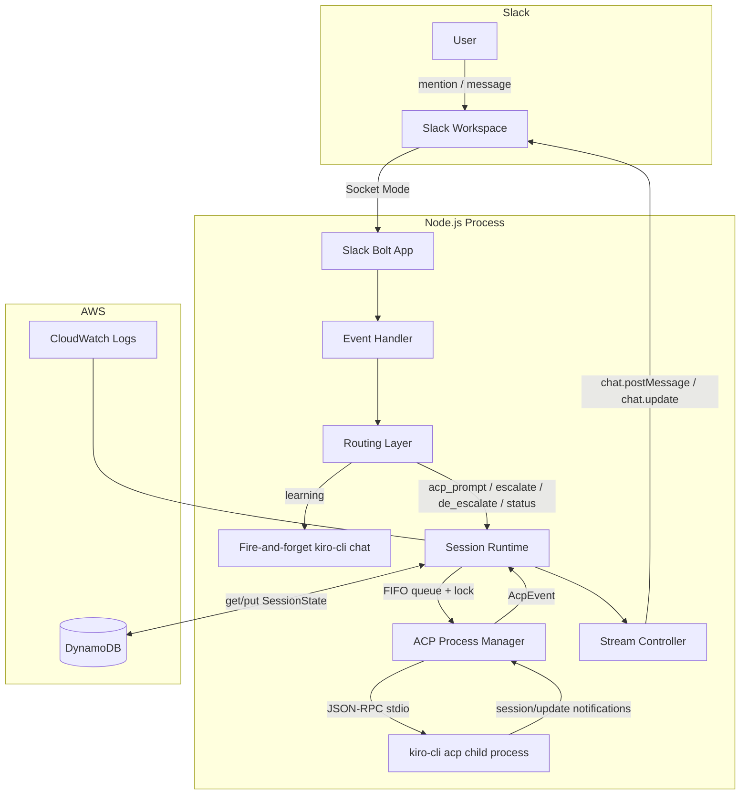
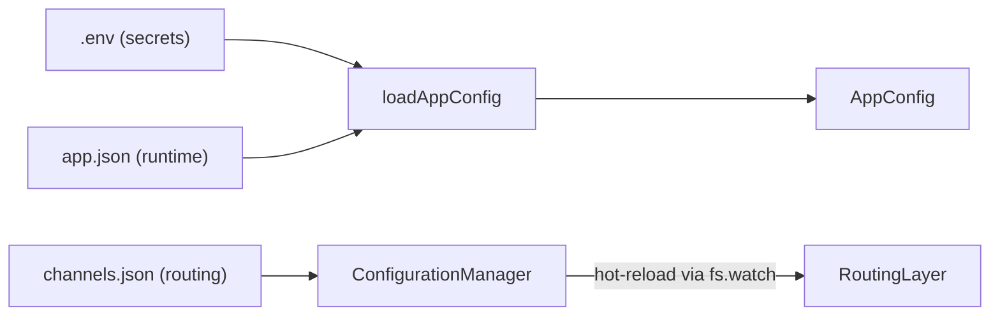

# Architecture

## System Overview

ChatOps AI Agent is a Slack bot that bridges Slack conversations to an ACP (Agent Control Protocol) backend. It runs `kiro-cli acp` as a long-lived JSON-RPC child process over stdio and translates between Slack's event-driven model and ACP's session-based model.

## Design Patterns

### Per-Thread Session Mapping
Each Slack thread (`channelId:threadTs`) maps to exactly one ACP session. The mapping is persisted in DynamoDB (prod) or an in-memory Map (dev). On process restart, sessions are recovered from DynamoDB and restored via `session/load`.

### FIFO Queue with Inflight Lock
Messages within a single Slack thread are serialized through a per-session FIFO queue. Only one message is "inflight" (being processed by ACP) at a time. New messages queue behind it. This prevents race conditions from concurrent Slack messages in the same thread.

### Promise-Chain Locking
Both `SlackSessionRuntime` and `SlackStreamController` use a promise-chain pattern for mutual exclusion — no external mutex library needed. Each lock key (session key or ACP session ID) chains new work onto the previous promise.

### Streaming Updates
ACP `session/update` notifications carrying `agent_message_chunk` are accumulated in a buffer and flushed to Slack via throttled `chat.update` calls (900ms throttle). On completion, the final text replaces the placeholder message. Messages exceeding Slack's byte limit are split across multiple messages.

### Agent Switching
Users can escalate to `architect-agent` or de-escalate to `senior-agent` mid-conversation. The switch is performed via `session/set_mode` (with a command fallback). Agent state persists across messages in the same thread.

### Transport Recycling
If `session/load` fails (e.g., stale session), the transport is recycled — the old child process is killed and a new one spawned. This prevents a corrupted ACP process from blocking all sessions.

## Configuration Architecture

Three-layer config with env var overrides. Channel config supports hot-reload without process restart.
