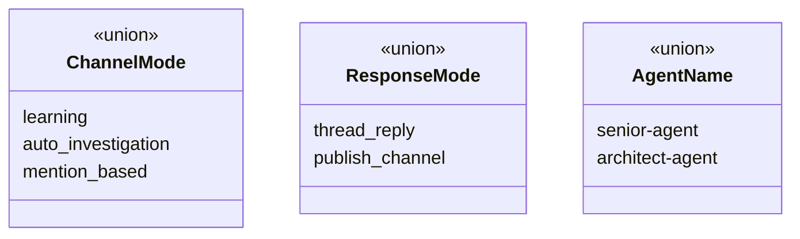

# Data Models

## Core Types (`src/types/index.ts`)

### Enums / Union Types

### ChannelConfig
Per-channel routing policy. Loaded from `channels.json`.

| Field | Type | Description |
|-------|------|-------------|
| `channelId` | `string` | Slack channel ID |
| `mode` | `ChannelMode` | How messages are processed |
| `responseMode` | `ResponseMode` | Where responses are sent |
| `publishChannelId` | `string?` | Target channel for `publish_channel` mode |
| `enabled` | `boolean?` | Defaults to true |

### SlackEvent
Normalized internal representation of a Slack event.

| Field | Type | Description |
|-------|------|-------------|
| `type` | `'app_mention' \| 'message'` | Event type |
| `messageText` | `string` | Sanitized message text |
| `channelId` | `string` | Source channel |
| `threadTs` | `string` | Thread timestamp (root ts if not in thread) |
| `userId` | `string` | Sender |
| `timestamp` | `string` | Event timestamp |

### SessionState
In-memory + persisted state for a Slack thread's ACP session.

| Field | Type | Description |
|-------|------|-------------|
| `sessionKey` | `string` | `THREAD#{channelId}:{threadTs}` |
| `acpSessionId` | `string` | ACP session identifier |
| `activeAgent` | `AgentName` | Current agent mode |
| `inflight` | `boolean` | Whether a request is being processed |
| `queue` | `SessionRequest[]` | Pending requests |
| `responseMode` | `ResponseMode` | Current response mode |
| `statusMessageTs` | `string?` | Slack message ts for streaming updates |
| `sessionNotice` | `string?` | One-time notice to prepend to next response |
| `lastUpdatedAt` | `string` | ISO timestamp |

### SessionRequest
A queued request within a session.

| Field | Type | Description |
|-------|------|-------------|
| `messageText` | `string` | User's message |
| `channelId` | `string` | Source channel |
| `threadTs` | `string` | Thread timestamp |
| `userId` | `string` | Requester |
| `timestamp` | `string` | Event timestamp |
| `kind` | `'prompt' \| 'escalation' \| 'de_escalation'?` | Request type |

### AcpEvent
Internal event emitted by the ACP transport layer.

| Field | Type | Description |
|-------|------|-------------|
| `sessionId` | `string` | ACP session ID |
| `type` | `'started' \| 'delta' \| 'final' \| 'error'` | Event type |
| `text` | `string?` | Content for delta/final |
| `error` | `string?` | Error message |
| `preserveBuffer` | `boolean?` | If true, use buffered text as final |

### AcpPromptPayload
Payload sent to ACP for a prompt request.

| Field | Type | Description |
|-------|------|-------------|
| `sessionId` | `string` | ACP session ID |
| `prompt` | `Array<{type: 'text', text: string}>` | Message content |
| `agent` | `AgentName` | Target agent |
| `metadata` | object | `channelId`, `threadTs`, `userId`, `requestKind` |

## DynamoDB Schema

**Table:** Configured via `DYNAMODB_TABLE_NAME` (default: `slack-kiro-sessions`)

| Attribute | Type | Key | Description |
|-----------|------|-----|-------------|
| `pk` | `S` | Hash | `THREAD#{channelId}:{threadTs}` |
| `acpSessionId` | `S` | GSI hash | ACP session identifier |
| `agentName` | `S` | — | Current agent |
| `responseMode` | `S` | — | Response mode |
| `inflight` | `BOOL` | — | Processing flag |
| `queue` | `S` | — | JSON-serialized `SessionRequest[]` |
| `statusMessageTs` | `S` | — | Slack placeholder message ts |
| `sessionNotice` | `S` | — | One-time notice |
| `lastUpdatedAt` | `S` | — | ISO timestamp |
| `createdAt` | `N` | — | Epoch ms |
| `lastActiveAt` | `N` | — | Epoch ms |
| `ttl` | `N` | — | TTL epoch seconds (90 days) |

**GSI:** `acpSessionId-index` — projects ALL attributes, keyed on `acpSessionId`.

## AppConfig

Loaded from `src/config/app.json` with env var overrides.

| Field | Env Override | Default |
|-------|-------------|---------|
| `port` | `PORT` | `3000` |
| `maxMessageLength` | `MAX_MESSAGE_LENGTH` | `10000` |
| `logLevel` | `LOG_LEVEL` | `info` |
| `channelConfigPath` | `CHANNEL_CONFIG_PATH` | `src/config/channels.json` |
| `cloudwatch.logGroup` | `CLOUDWATCH_LOG_GROUP` | `/chatops-ai-agent/app` |
| `cloudwatch.logStream` | `CLOUDWATCH_LOG_STREAM` | `slack-bot` |
| `aws.region` | `AWS_REGION` | `us-east-1` |
| `aws.dynamoTableName` | `DYNAMODB_TABLE_NAME` | `slack-kiro-sessions` |
| `acpCommand` | `ACP_COMMAND` | `kiro-cli acp` |
| `acpDefaultAgent` | `ACP_DEFAULT_AGENT` | `''` |
