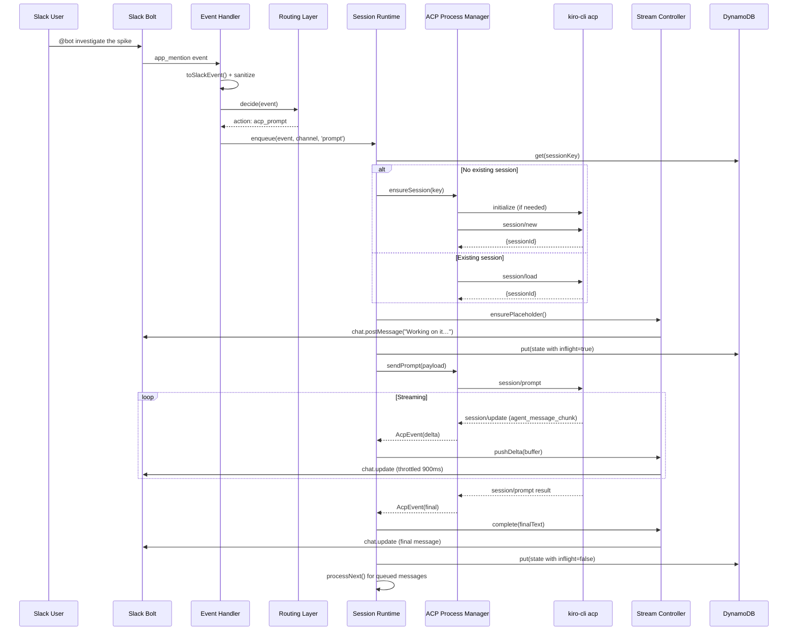
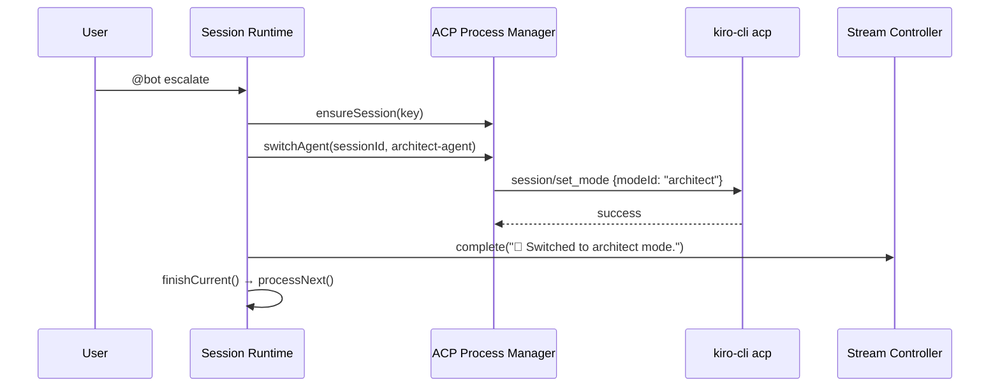
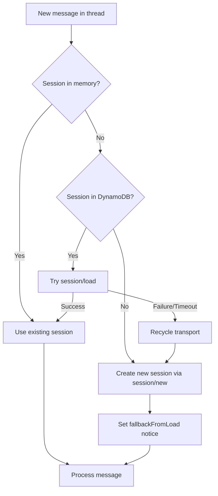
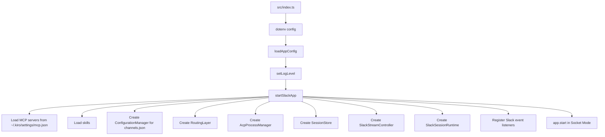
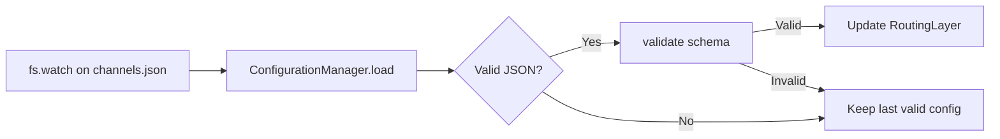

# Workflows

## Message Processing Flow

```mermaid
sequenceDiagram
    participant U as Slack User
    participant B as Slack Bolt
    participant EV as Event Handler
    participant RT as Routing Layer
    participant SR as Session Runtime
    participant APM as ACP Process Manager
    participant ACP as kiro-cli acp
    participant SC as Stream Controller
    participant DB as DynamoDB

    U->>B: @bot investigate the spike
    B->>EV: app_mention event
    EV->>EV: toSlackEvent() + sanitize
    EV->>RT: decide(event)
    RT-->>EV: action: acp_prompt
    EV->>SR: enqueue(event, channel, 'prompt')

    SR->>DB: get(sessionKey)
    alt No existing session
        SR->>APM: ensureSession(key)
        APM->>ACP: initialize (if needed)
        APM->>ACP: session/new
        ACP-->>APM: {sessionId}
    else Existing session
        APM->>ACP: session/load
        ACP-->>APM: {sessionId}
    end

    SR->>SC: ensurePlaceholder()
    SC->>B: chat.postMessage("Working on it…")
    SR->>DB: put(state with inflight=true)
    SR->>APM: sendPrompt(payload)
    APM->>ACP: session/prompt

    loop Streaming
        ACP-->>APM: session/update (agent_message_chunk)
        APM-->>SR: AcpEvent(delta)
        SR->>SC: pushDelta(buffer)
        SC->>B: chat.update (throttled 900ms)
    end

    ACP-->>APM: session/prompt result
    APM-->>SR: AcpEvent(final)
    SR->>SC: complete(finalText)
    SC->>B: chat.update (final message)
    SR->>DB: put(state with inflight=false)
    SR->>SR: processNext() for queued messages
```

## Agent Escalation Flow

```mermaid
sequenceDiagram
    participant U as User
    participant SR as Session Runtime
    participant APM as ACP Process Manager
    participant ACP as kiro-cli acp
    participant SC as Stream Controller

    U->>SR: @bot escalate
    SR->>APM: ensureSession(key)
    SR->>APM: switchAgent(sessionId, architect-agent)
    APM->>ACP: session/set_mode {modeId: "architect"}
    ACP-->>APM: success
    SR->>SC: complete("🔀 Switched to architect mode.")
    SR->>SR: finishCurrent() → processNext()
```

## Session Recovery Flow

```mermaid
flowchart TD
    A[New message in thread] --> B{Session in memory?}
    B -->|Yes| F[Use existing session]
    B -->|No| C{Session in DynamoDB?}
    C -->|No| E[Create new session via session/new]
    C -->|Yes| D[Try session/load]
    D -->|Success| F
    D -->|Failure/Timeout| G[Recycle transport]
    G --> E
    E --> H[Set fallbackFromLoad notice]
    F --> I[Process message]
    H --> I
```

## Startup Flow

```mermaid
flowchart TD
    A[src/index.ts] --> B[dotenv config]
    B --> C[loadAppConfig]
    C --> D[setLogLevel]
    D --> E[startSlackApp]
    E --> F[Load MCP servers from ~/.kiro/settings/mcp.json]
    E --> G[Load skills]
    E --> H[Create ConfigurationManager for channels.json]
    E --> I[Create RoutingLayer]
    E --> J[Create AcpProcessManager]
    E --> K[Create SessionStore]
    E --> L[Create SlackStreamController]
    E --> M[Create SlackSessionRuntime]
    E --> N[Register Slack event listeners]
    E --> O[app.start in Socket Mode]
```

## Channel Config Hot-Reload

```mermaid
flowchart LR
    A[fs.watch on channels.json] --> B[ConfigurationManager.load]
    B --> C{Valid JSON?}
    C -->|Yes| D[validate schema]
    C -->|No| E[Keep last valid config]
    D -->|Valid| F[Update RoutingLayer]
    D -->|Invalid| E
```
